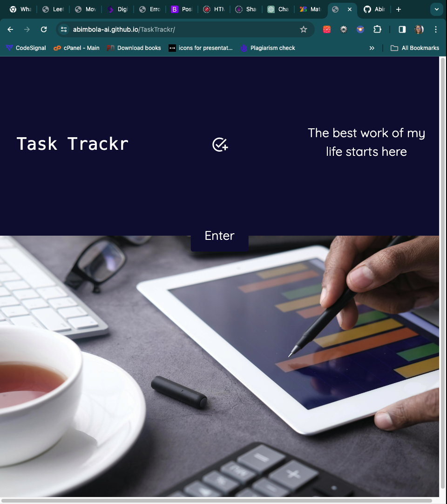
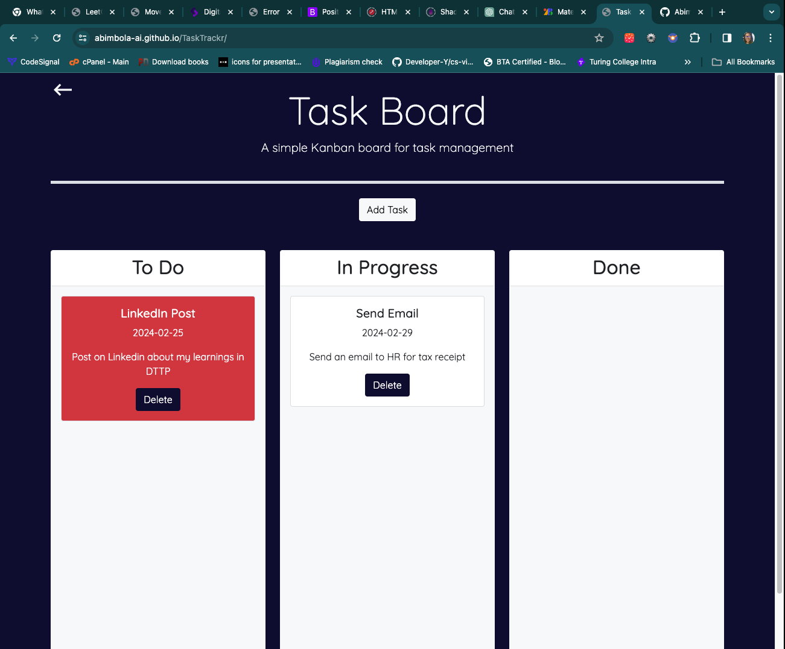

# Task Trackr

This project presents a task board application designed to facilitate project task management for teams. Developed as part of my skill development journey at DTTP - SkillHat, the assignment represents one of several projects undertaken during this phase. [SkillHat](https://skillhat.ca/) serves as a pivotal link between technological talent and industry demands.

## Table of Contents

- [Overview](#overview)
  - [User Story](#user-story)
  - [Acceptance Criteria](#acceptance-criteria)
- [Project Features](#project-features)
- [Implementation Details](#implementation-details)
  - [Screenshot](#screenshot)
  - [Links](#links)
- [Challenges Overcome](#challenges-overcome)
- [Future Improvement](#future-improvement)
- [Author](#author)
- [Acknowledgements](#acknowledgements)

## Overview

### User Story

As a project team member with multiple tasks to organize:

- I WANT a task board
- SO THAT I can add individual project tasks, manage their state of progress and track overall project progress accordingly.

### Acceptance Criteria

- GIVEN a task board to manage a project
- WHEN I open the task board THEN the list of project tasks is displayed in columns representing the task progress state (Not Yet Started, In Progress, Completed)
- WHEN I view the task board for the project THEN each task is color coded to indicate whether it is nearing the deadline (yellow) or is overdue (red)
- WHEN I click on the button to define a new task THEN I can enter the title, description and deadline date for the new task into a modal dialog
- WHEN I click the save button for that task THEN the properties for that task are saved in localStorage
- WHEN I drag a task to a different progress column THEN the task's progress state is updated accordingly and will stay in the new column after refreshing
- WHEN I click the delete button for a task THEN the task is removed from the task board and will not be added _back after refreshing_
- _WHEN I refresh the page THEN the saved tasks persist_

## Project Features

- **Task Management** : Organize tasks into different categories such as "To Do", "In Progress", and "Done".

* **Drag and Drop** : Easily move tasks between categories using drag and drop functionality.
* **Task Creation** : Add new tasks with titles, due dates, and descriptions.
* **Task Deletion** : Remove tasks from the board with a single click.
* **Responsive Design** : Works seamlessly on various devices.

## Implementation Details

- The project is implemented using HTML, CSS, JavaScript, jQuery, and Bootstrap. Here's a brief overview of key functions:

* **`generateTaskId()`:** Generates a unique task ID for each task.
* **`createTaskCard(title, dueDate, description)`:** Creates a task card with provided details.
* **`renderTaskList(category)`:** Renders tasks for a specific category from local storage.
* **`addTask(category, task)`:** Adds a new task to the specified category in local storage.
* **`addTaskToTodoList(title, dueDate, description)`:** Adds a new task to the "To Do" category and generates a corresponding card.
* **`moveTask(taskId, fromCategory, toCategory)`:** Moves tasks from one category to another.
* **`removeTask(taskId, category)`:** Deletes a task from local storage.

### Screenshot

### Links

- [Solution GitHub URL](https://github.com/Abimbola-ai/TaskTrackr)
- [Live Site URL](https://abimbola-ai.github.io/TaskTrackr/ 'live site')

## Challenges Overcome

- **LocalStorage Management** : Ensuring tasks are stored and retrieved accurately from local storage.

* **Drag and Drop Functionality** : Implementing smooth drag and drop functionality for task management.
* **Responsive Design** : Creating a responsive layout that works well on different screen sizes.

## Future Improvements

- **User Authentication** : Implement user authentication to allow multiple users to manage their tasks securely.

* **Search and Filter** : Add functionality to search for tasks and filter them based on various criteria.
* **Customization Options** : Allow users to customize the appearance of the board and tasks.
* **Notifications** : Integrate notifications to remind users of upcoming task deadlines.

## Author

- LinkedIn - [ojikutu-olajumoke](https://www.linkedin.com/in/ojikutu-olajumoke/)

## Acknowledgements

A big thanks to SkillHat for providing a platform to challenge and enhance my abilities. Thanks also to my frontend instructor [Edward Apostol](https://www.linkedin.com/in/edwardapostol/ 'Instructor') and Teaching assistants Babatunde Koiki, Daniel. Design inspiration from [Canva](https://www.canva.com/)
